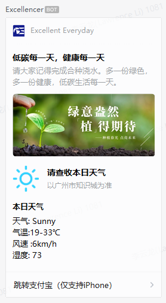

## 背景：
企业微信部门群的聊天机器人目前已经趋于稳定，把关键实现方式记录下来，方便后续维护。
大家如有其他建议和想法也可一起讨论。
## 实现方式：
每个企业微信机器人有一个独有的Webhook地址（需要保密，不公开），可以通过HTTP接口来联动（目前只用了POST）。HTTP POST的方式有很多种，试了很多其他的方法，最后采用的是[IFTTT.com](https://ifttt.com/explore)触发。这种方式较为简单，分条件和触发两个参数，不需要部署服务器，而且包含5个免费自动化额度。缺点是国外网站，访问速度慢。

目前每天有两条消息，分别为：
### 1. 每天早上7点发送消息，包含天气信息
**条件条件**：IFTTT的天气服务，每天7点获取天气信息
**触发**：Webhook，HTTP POST，内容为json格式

```json
{
    "msgtype": "markdown",
    "markdown": {
        "content": "早晨起来，拥抱太阳。骑上绿码，满满正能量！请大家记得每日申报并填写收集表，\n本日天气: {{TodaysCondition}}\n气温:{{LowTempCelsius}}-{{HighTempCelsius}}℃\nUV Index: {{UvIndex}}\n风速 :{{WindSpeedKph}}km/h"
    }
}
```
实际效果：


#### 第二版，植树主题：

```json
{
    "msgtype":"template_card",
    "template_card":{
        "card_type":"news_notice",
        "source":{
            "icon_url":"http://picturebucket4md.oss-cn-shenzhen.aliyuncs.com/ossbrs/White-OE-Square%20Background.png",
            "desc":"Excellent Everyday",
            "desc_color":0
        },
        "main_title":{
            "title":"低碳每一天，健康每一天",
            "desc":"请大家记得完成合种浇水。多一份绿色，多一份健康，低碳生活每一天。"
        },
        "card_image":{
            "url":"http://picturebucket4md.oss-cn-shenzhen.aliyuncs.com/ossbrs/oe1.jpg",
            "aspect_ratio":2.25
        },
        "image_text_area":{
            "type":1,
            "url":"http://picturebucket4md.oss-cn-shenzhen.aliyuncs.com/ossbrs/oe1.jpg",
            "title":"请查收本日天气",
            "desc":"以广州市知识城为准",
            "image_url":"{{TodaysConditionImageURL}}"
        },
        "vertical_content_list":[
            {
                "title":"本日天气",
                "desc":"天气: {{TodaysCondition}}\n气温:{{LowTempCelsius}}-{{HighTempCelsius}}℃\n风速 :{{WindSpeedKph}}km/h\n湿度: {{Humidity}}"
            }
        ],
                "jump_list":[
            {
                "type":1,
                "url":"alipay://platformapi/startapp?sald=60000002",
                "title":"跳转支付宝（仅支持iPhone）"
            }
        ],
        "card_action":{
            "type":1,
            "url":"alipay://platformapi/startapp?sald=60000002",
            "appid":"APPID",
            "pagepath":"PAGEPATH"
        }
    }
}

```

实际效果：



#### 第三版 （植树活动结束）

```json
{
    "msgtype":"template_card",
    "template_card":{
        "card_type":"news_notice",
        "source":{
            "icon_url":"http://picturebucket4md.oss-cn-shenzhen.aliyuncs.com/ossbrs/White-OE-Square%20Background.png",
            "desc":"Excellent Everyday",
            "desc_color":0
        },
        "image_text_area":{
            "type":1,
            "url":"http://picturebucket4md.oss-cn-shenzhen.aliyuncs.com/ossbrs/oe1.jpg",
            "title":"新的一天，新的开始",
            "desc":"请查收今日天气",
            "image_url":"{{TodaysConditionImageURL}}"
        },
        "vertical_content_list":[
            {
                "title":"当前气温：{{CurrentTempCelsius}}℃",
                "desc":"天气: {{TodaysCondition}}\n气温:{{LowTempCelsius}}-{{HighTempCelsius}}℃\n风速 :{{WindSpeedKph}}km/h\n湿度: {{Humidity}}"
            }
        ],
                "jump_list":[
            {
                "type":1,
                "url":"https://www.tapd.cn/49064833/bugtrace/bugs/add?&template_id=1149064833001000225",
                "title":"去TAPD反馈意见"
            }
        ],
        "card_action":{
            "type":1,
            "url":"https://www.tapd.cn/49064833/bugtrace/bugs/add?&template_id=1149064833001000225",
            "appid":"APPID",
            "pagepath":"PAGEPATH"
        }
    }
}
```


### 2.每天9点半发送消息提醒大家申报(已废弃)

> 因为公司取消每日申报，此推送已取消

**条件**：纯时间
**触发**：Webhook，Method： POST，Content Type：application/json，body为json格式。此条信息使用了企业微信的图片卡格式，具体可以在微信的api文档中查看，图片url为网上的一个随机图片api，如失效可替换为其他图片url。

``` json
{
    "msgtype": "news",
    "news": {
       "articles" : [
           {
               "title" : "健康申报提醒",
               "description" : "各位早，健康申报天天有约，还有最后30分钟，忙碌的同时也不要忘记申报",
               "url" : "https://www.dxdin.cn/WECOMCNMA/?code=n7WdFabPRpVj0EVaOzlvakmzWgX6pYt84ITM07cVmRc&state=",
               "picurl" : "https://api.isoyu.com/bing_images.php"
           }
        ]
    }
}
```
实际效果：

点击页面可以跳转公司的申报链接（但是需要手动输入工号)，建议大家直接在企业微信的工作台进入。


### **3. 小群机器人测试（反卷提醒）**

```json
{
    "msgtype":"template_card",
    "template_card":{
        "card_type":"news_notice",
        "source":{
            "icon_url":"http://picturebucket4md.oss-cn-shenzhen.aliyuncs.com/ossbrs/White-OE-Square%20Background.png",
            "desc":"OE Software Squad",
            "desc_color":0
        },
        "main_title":{
            "title":"轻松一下",
            "desc":"别卷了，让我们享用美味的午餐吧"
        },
        "card_image":{
            "url":"http://picturebucket4md.oss-cn-shenzhen.aliyuncs.com/ossbrs/anyone-alive.gif",
            "aspect_ratio":1.3
        },
        "image_text_area":{
            "type":1,
            "url":"https://work.weixin.qq.com",
            "title":"请查收当前天气",
            "desc":"以广州市知识城为准",
            "image_url":"{{TodaysConditionImageURL}}"
        },
        "vertical_content_list":[
            {
                "title":"当前气温：{{CurrentTempCelsius}}",
                "desc":"本日天气: {{TodaysCondition}}\n气温:{{LowTempCelsius}}-{{HighTempCelsius}}℃\nUV Index: {{UvIndex}}\n风速 :{{WindSpeedKph}}km/h\n湿度: {{Humidity}}"
            }
        ],
                "jump_list":[
            {
                "type":1,
                "url":"https://render.alipay.com/p/s/i/?scheme=alipays%3A%2F%2Fplatformapi%2Fstartapp%3FappId%3D60000002%26url%3D%252Fwww%252Fhome.html%253Fsource%253Dfxyoushangjiao%2526shareId%253D7d%25252BzgVfcEHg3uPWlsjKdEU5CG8EP%25252BDE3zGDuUHj9ciU%25253D%26chInfo%3Dch_share__chsub_CopyLink%26fxzjshareChinfo%3Dch_share__chsub_CopyLink%26apshareid%3D7E99CA87-43AA-4A11-A4CB-31215D312B19%26shareBizType%3Dantforesthongbao",
                "title":"测试链接"
            }
        ],
        "card_action":{
            "type":1,
            "url":"https://www.tapd.cn/49064833/prong/stories/stories_list",
            "appid":"APPID",
            "pagepath":"PAGEPATH"
        }
    }
}
```

